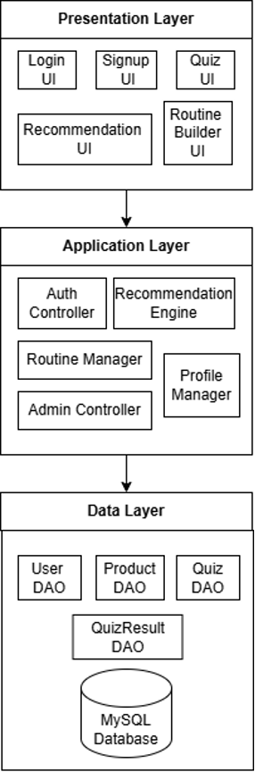
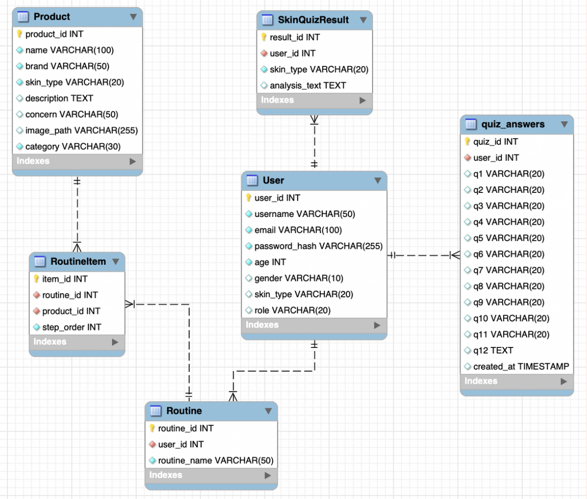

# GlowGuideWeb
GlowGuide is a web-based skincare recommendation and routine management system designed to enhance the user’s skincare experience through personalized analysis.

## Project Overview
The system allows users to create an account, log in, and receive personalized skincare recommendations based on their skin type and concerns. Users can take a detailed skincare quiz, view recommended products, and manage their skincare routine by organizing products into morning and night routines.

## Key Features
- User account creation and authentication
- Skincare quiz for skin type and concerns analysis
- Personalized product recommendations
- Add and remove products from skincare routines
- Separate morning and night skincare routines
- Secure data storage and retrieval using MySQL

## Technologies Used
- Java (Servlets & JDBC)
- HTML
- MySQL
- NetBeans IDE
- Apache Tomcat

## Testing Scope
This project includes:
- Functional testing of implemented features
- Integration testing between UI, Servlets, DAO layer, and database
- System testing for complete user workflow

The project does not include performance testing, security penetration testing, payment systems, or external API integration.

## System Architecture
The following diagram illustrates the overall architecture of the GlowGuide system, including the presentation, application, and data layers.

## Database Design
The following ER diagram illustrates the database structure and relationships between users, routines, products, quizzes, and results.

## Notes
- This project runs locally and is not deployed online.
- Database credentials are not included for security reasons.

